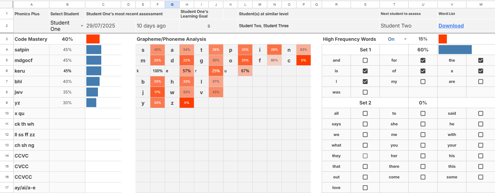

# A tool to monitor achievement and identify explicit target areas
### Aligned with the 'Phonics Plus' Structured-Synthetic-Phonics Program from DET

  

This is my Phonics Plus Page. 

I wonder if I can embedd Youtube below...
<iframe width="560" height="315" src="https://www.youtube.com/embed/dQw4w9WgXcQ?si=DsIudnEbD4oYo2UO" title="YouTube video player" frameborder="0" allow="accelerometer; autoplay; clipboard-write; encrypted-media; gyroscope; picture-in-picture; web-share" referrerpolicy="strict-origin-when-cross-origin" allowfullscreen></iframe>